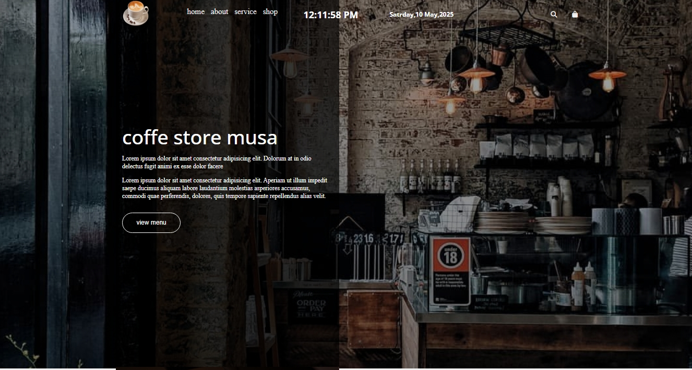
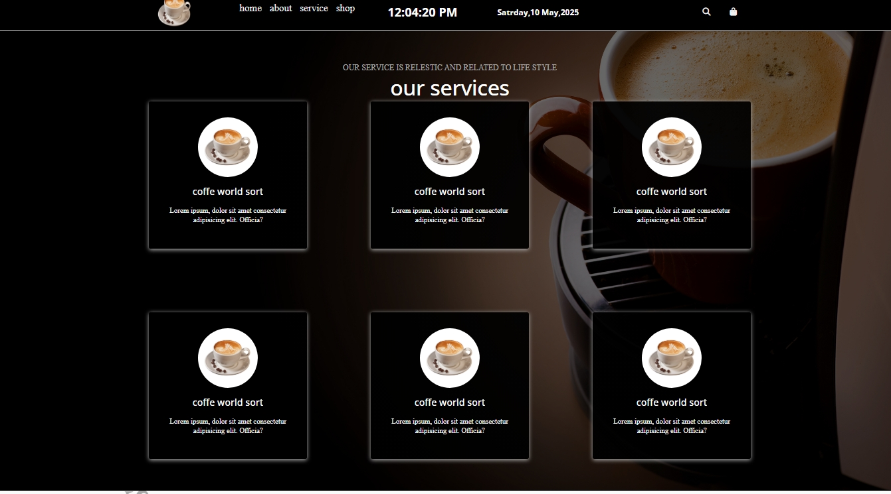
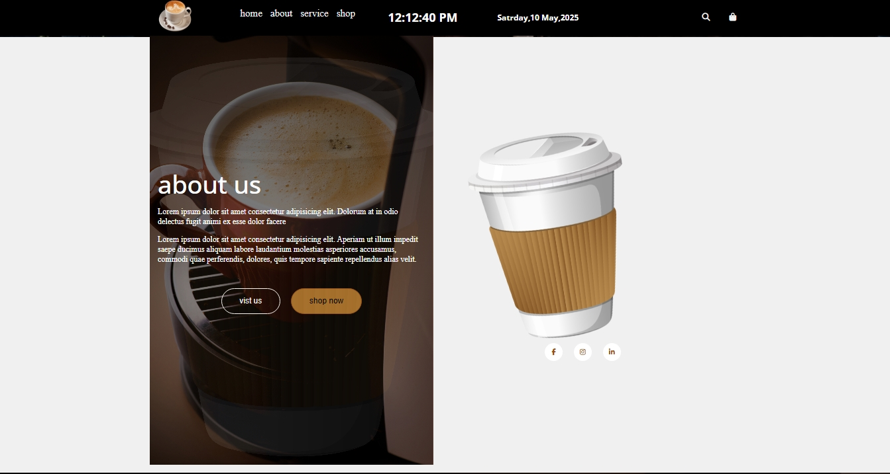

# ☕ Coffee Restaurant Website

A clean and stylish coffee shop website built with **HTML, CSS, and JavaScript**. This **responsive one-page layout** is perfect for a cafe, restaurant, or coffee brand.

---

## 🌐 **Live Demo**

🔗 **[👉 Click Here to View the Live Site 👈](https://mousacr7.github.io/Coffee-restaurant/)**

---

## 📸 **Screenshots**

### 🏠 **Full Homepage**

### 📋 **Menu Section**

### 📋 **Gallry Section**

### 📋 **Menu Section**

## ✨ **Key Features**

✅ **Fully Responsive** on all devices  
✅ **Smooth Scrolling** navigation  
✅ **Hero Section** with call-to-action  
✅ **Beautiful Coffee Menu** with items and prices  
✅ **Image Gallery** for showcasing drinks  
✅ **Contact Form** with basic validation  
✅ **Footer** with newsletter form and social icons  

---

## 🧰 **Built With**

- 🧱 **HTML5**
- 🎨 **CSS3**
- ⚙️ **JavaScript (Vanilla)**

---

## 🗂️ **Project Structure**

Coffee-restaurant/
├── index.html
├── style.css
├── script.js
├── images/
└── screenshots/

## 🚀 **Getting Started**

1. 📥 **Clone the Repository**  
   git clone https://github.com/Mousacr7/Coffee-restaurant.git
🌐 Open index.html in your browser

👤 Author
MousaCR7
📎 GitHub: @Mousacr7

📝 Feel free to fork the project or contribute. Star ⭐ the repo if you found it helpful!